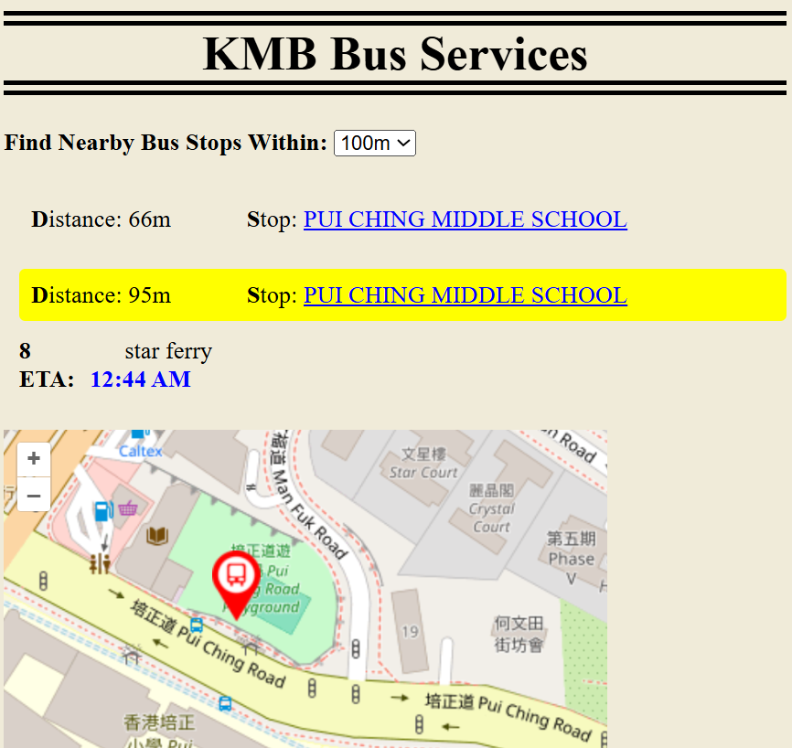

# KMB-bus-stops 🚌 (OpenLayers version)
A Web app that allows users to locate nearby KMB (Kowloon Motor Bus) bus stops and the estimated time of arrival of bus routes at those nearby bus stops. This Web app uses the Open Data provided by KMB through the HKSAR Transport Department. The Web app should be nicely rendered on any desktop computer and smartphone.

  

## Build with
This project was built using these technologies.
- HTML5
- CSS
- JavaScript
- AJAX

## Features
- Get user location 🧍‍♂️
- Make use of Open Data
- Dynamic content
- SessionStorage to cache data
- Display map information
- Fully Responsive (support both smartphone and desktop)

## Two datasets (open data APL) used
1️⃣Stop List API (https://data.etabus.gov.hk/v1/transport/kmb/stop)
The data provided by this API is only updated daily at 05:00. There are more than 6 thousand bus stop information; each stop contains the names, a unique stop ID, and the geolocation coordinates.

2️⃣Stop ETA API (https://data.etabus.gov.hk/v1/transport/kmb/stop-eta/{stop_id})
The ETA data provided by this API is updated every one minute. The data used for this web app are the  “route”, “dir”, “service_type”, “dest_en”, “eta_seq”, and “eta” fields.

